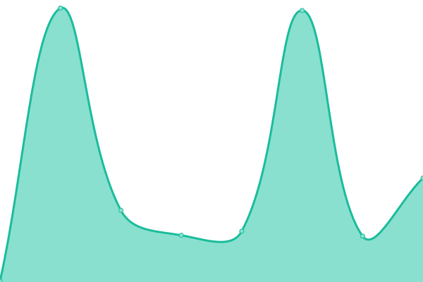
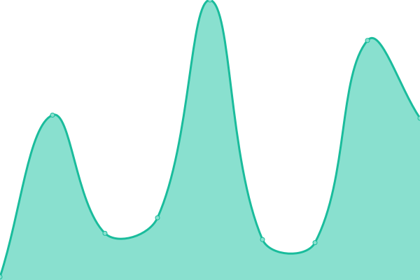
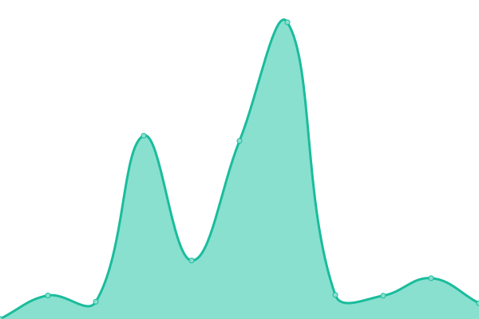
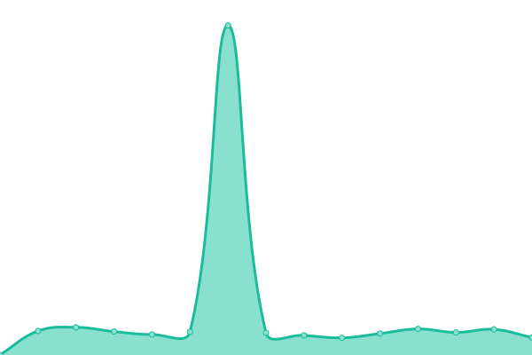

# [📈 Live Status](https://status.zollege.com): <!--live status--> **🟧 Partial outage**

This repository contains the open-source uptime monitor and status page for [Zollege](https://zollege.com), powered by [Upptime](https://github.com/upptime/upptime).

With [Upptime](https://upptime.js.org), you can get your own unlimited and free uptime monitor and status page, powered entirely by a GitHub repository. We use [Issues](https://github.com/Zollege/status/issues) as incident reports, [Actions](https://github.com/Zollege/status/actions) as uptime monitors, and [Pages](https://status.zollege.com) for the status page.

<!--start: status pages-->
<!-- This summary is generated by Upptime (https://github.com/upptime/upptime) -->
<!-- Do not edit this manually, your changes will be overwritten -->
<!-- prettier-ignore -->
| URL | Status | History | Response Time | Uptime |
| --- | ------ | ------- | ------------- | ------ |
|  [Website Start Dates](https://zql.zollege.com/api/5fcaa0e04289f50021ae2b3b?apiKey=f83707c1-2f29-4946-9a47-530e1242fb0e&format=json) | 🟩 Up | [website-start-dates.yml](https://github.com/Zollege/status/commits/HEAD/history/website-start-dates.yml) | 

 335ms
     
 | 

<a href="https://status.zollege.com/history/website-start-dates">97.81%</a>
    

|  [ZQL](https://zql.zollege.com/api/ping/) | 🟩 Up | [zql.yml](https://github.com/Zollege/status/commits/HEAD/history/zql.yml) | 

 55ms
     
 | 

<a href="https://status.zollege.com/history/zql">100.00%</a>
    

|  [Reports (Metabase)](https://reports.zollege.com/api/health) | 🟩 Up | [reports-metabase.yml](https://github.com/Zollege/status/commits/HEAD/history/reports-metabase.yml) | 

 267ms
     
 | 

<a href="https://status.zollege.com/history/reports-metabase">100.00%</a>
    

|  [Lambda](https://4runw89p71.execute-api.us-west-1.amazonaws.com/latest/ping) | 🟩 Up | [lambda.yml](https://github.com/Zollege/status/commits/HEAD/history/lambda.yml) | 

 775ms
     
 | 

<a href="https://status.zollege.com/history/lambda">100.00%</a>
    

|  [Learn (Canvas)](https://learn.zollege.com/health_check/) | 🟩 Up | [learn-canvas.yml](https://github.com/Zollege/status/commits/HEAD/history/learn-canvas.yml) | 

 374ms
     
 | 

<a href="https://status.zollege.com/history/learn-canvas">100.00%</a>
    

|  [Zollege LTI (Canvas)](https://lti.zollege.com/ping/) | 🟩 Up | [zollege-lti-canvas.yml](https://github.com/Zollege/status/commits/HEAD/history/zollege-lti-canvas.yml) | 

 265ms
     
 | 

<a href="https://status.zollege.com/history/zollege-lti-canvas">100.00%</a>
    

|  [Zollege LTI (Open edX)](https://openedx.zollege.com/ping/) | 🟩 Up | [zollege-lti-open-ed-x.yml](https://github.com/Zollege/status/commits/HEAD/history/zollege-lti-open-ed-x.yml) | 

 185ms
     
 | 

<a href="https://status.zollege.com/history/zollege-lti-open-ed-x">100.00%</a>
    

|  [Externship Office - LTI Lite (Canvas)](https://zql.zollege.com/lti/externship-office?email=r.watkins@zollege.com) | 🟩 Up | [externship-office-lti-lite-canvas.yml](https://github.com/Zollege/status/commits/HEAD/history/externship-office-lti-lite-canvas.yml) | 

 166ms
     
 | 

<a href="https://status.zollege.com/history/externship-office-lti-lite-canvas">100.00%</a>
    

|  [New Externship Form - LTI Lite (Canvas)](https://zql.zollege.com/lti/new-externship-form?displayName=Rob%20Watkins&userId=16&email=r.watkins@zollege.com&courseName=Robs%20Test%20JS411&courseId=7&courseStart=2020-12-28T23:35:00Z&student=true) | 🟩 Up | [new-externship-form-lti-lite-canvas.yml](https://github.com/Zollege/status/commits/HEAD/history/new-externship-form-lti-lite-canvas.yml) | 

 57ms
     
 | 

<a href="https://status.zollege.com/history/new-externship-form-lti-lite-canvas">100.00%</a>
    

|  [File Upload - LTI Lite (Canvas)](https://zql.zollege.com/lti/file-upload?email=r.watkins@zollege.com) | 🟩 Up | [file-upload-lti-lite-canvas.yml](https://github.com/Zollege/status/commits/HEAD/history/file-upload-lti-lite-canvas.yml) | 

 51ms
     
 | 

<a href="https://status.zollege.com/history/file-upload-lti-lite-canvas">100.00%</a>
    

|  [Class File Upload - LTI Lite (Canvas)](https://zql.zollege.com/lti/class-file-upload?email=r.watkins@zollege.com&courseId=7) | 🟩 Up | [class-file-upload-lti-lite-canvas.yml](https://github.com/Zollege/status/commits/HEAD/history/class-file-upload-lti-lite-canvas.yml) | 

 53ms
     
 | 

<a href="https://status.zollege.com/history/class-file-upload-lti-lite-canvas">100.00%</a>
    

|  [End of Course Survey - LTI Lite (Canvas)](https://zql.zollege.com/lti/end-of-course-survey?name=Rob%20Watkins&email=r.watkins@zollege.com&userId=16&courseName=Robs%20Test%20JS411&courseId=7&courseStart=2020-12-28T23:35:00Z) | 🟩 Up | [end-of-course-survey-lti-lite-canvas.yml](https://github.com/Zollege/status/commits/HEAD/history/end-of-course-survey-lti-lite-canvas.yml) | 

 51ms
     
 | 

<a href="https://status.zollege.com/history/end-of-course-survey-lti-lite-canvas">100.00%</a>
    

|  [Student Feedback - LTI Lite (Canvas)](https://zql.zollege.com/lti/student-feedback?name=Rob%20Watkins&email=r.watkins@zollege.com&userId=16&courseName=Robs%20Test%20JS411&courseId=7&courseStart=2020-12-28T23:35:00Z) | 🟩 Up | [student-feedback-lti-lite-canvas.yml](https://github.com/Zollege/status/commits/HEAD/history/student-feedback-lti-lite-canvas.yml) | 

 55ms
     
 | 

<a href="https://status.zollege.com/history/student-feedback-lti-lite-canvas">100.00%</a>
    

|  [Invoice - LTI Lite (Canvas)](https://zql.zollege.com/lti/invoice?email=r.watkins@zollege.com) | 🟥 Down | [invoice-lti-lite-canvas.yml](https://github.com/Zollege/status/commits/HEAD/history/invoice-lti-lite-canvas.yml) | 

 2131ms
     
 | 

<a href="https://status.zollege.com/history/invoice-lti-lite-canvas">97.67%</a>
    

|  [Submit Medical Externship Form](https://zql.zollege.com/lti/submit-medical-externship-form?email=r.watkins%40zollege.com&displayName=Rob+Watkins&userId=16&courseName=Robs+Test+JS411&courseStart=2020-12-28T23%3A35%3A00Z&courseId=7) | 🟩 Up | [submit-medical-externship-form.yml](https://github.com/Zollege/status/commits/HEAD/history/submit-medical-externship-form.yml) | 

 137ms
     
 | 

<a href="https://status.zollege.com/history/submit-medical-externship-form">98.69%</a>
    

|  [Submit Dental Externship Form](https://zql.zollege.com/lti/submit-dental-externship-form?email=r.watkins%40zollege.com&displayName=Rob+Watkins&userId=16&courseName=Robs+Test+JS411&courseStart=2020-12-28T23%3A35%3A00Z&courseId=7) | 🟩 Up | [submit-dental-externship-form.yml](https://github.com/Zollege/status/commits/HEAD/history/submit-dental-externship-form.yml) | 

 81ms
     
 | 

<a href="https://status.zollege.com/history/submit-dental-externship-form">98.69%</a>
    

|  [Zollege](https://zollege.com/) | 🟩 Up | [zollege.yml](https://github.com/Zollege/status/commits/HEAD/history/zollege.yml) | 

 195ms
     
 | 

<a href="https://status.zollege.com/history/zollege">100.00%</a>
    

|  [Abilene Dental Assistant School](https://abilenedentalassistantschool.com/) | 🟩 Up | [abilene-dental-assistant-school.yml](https://github.com/Zollege/status/commits/HEAD/history/abilene-dental-assistant-school.yml) | 

 240ms
     
 | 

<a href="https://status.zollege.com/history/abilene-dental-assistant-school">100.00%</a>
    

|  [Abilene Medical Assistant School](https://abilenemedicalassistant.com/) | 🟩 Up | [abilene-medical-assistant-school.yml](https://github.com/Zollege/status/commits/HEAD/history/abilene-medical-assistant-school.yml) | 

 226ms
     
 | 

<a href="https://status.zollege.com/history/abilene-medical-assistant-school">100.00%</a>
    

|  [Alvin Dental Assistant School](https://alvindentalassistant.com/) | 🟩 Up | [alvin-dental-assistant-school.yml](https://github.com/Zollege/status/commits/HEAD/history/alvin-dental-assistant-school.yml) | 

 233ms
     
 | 

<a href="https://status.zollege.com/history/alvin-dental-assistant-school">100.00%</a>
    

|  [Amarillo Dental Assistant School](https://amarillodentalassistantschool.com/) | 🟩 Up | [amarillo-dental-assistant-school.yml](https://github.com/Zollege/status/commits/HEAD/history/amarillo-dental-assistant-school.yml) | 

 235ms
     
 | 

<a href="https://status.zollege.com/history/amarillo-dental-assistant-school">100.00%</a>
    

|  [Amarillo Medical Assistant School](https://amarillomedicalassistantschool.com/) | 🟩 Up | [amarillo-medical-assistant-school.yml](https://github.com/Zollege/status/commits/HEAD/history/amarillo-medical-assistant-school.yml) | 

 251ms
     
 | 

<a href="https://status.zollege.com/history/amarillo-medical-assistant-school">100.00%</a>
    

|  [Atlanta Dental Assistant School](https://atlantadentalassistantschool.com/) | 🟩 Up | [atlanta-dental-assistant-school.yml](https://github.com/Zollege/status/commits/HEAD/history/atlanta-dental-assistant-school.yml) | 

 209ms
     
 | 

<a href="https://status.zollege.com/history/atlanta-dental-assistant-school">100.00%</a>
    

|  [Atlanta Medical Assistant School](https://atlantamedicalassistant.com/) | 🟩 Up | [atlanta-medical-assistant-school.yml](https://github.com/Zollege/status/commits/HEAD/history/atlanta-medical-assistant-school.yml) | 

 207ms
     
 | 

<a href="https://status.zollege.com/history/atlanta-medical-assistant-school">100.00%</a>
    

|  [Augusta Dental Assistant School](https://augustadentalassistant.com/) | 🟩 Up | [augusta-dental-assistant-school.yml](https://github.com/Zollege/status/commits/HEAD/history/augusta-dental-assistant-school.yml) | 

 233ms
     
 | 

<a href="https://status.zollege.com/history/augusta-dental-assistant-school">100.00%</a>
    

|  [Austin Dental Assistant School](https://austindentalassistantschool.com/) | 🟩 Up | [austin-dental-assistant-school.yml](https://github.com/Zollege/status/commits/HEAD/history/austin-dental-assistant-school.yml) | 

 233ms
     
 | 

<a href="https://status.zollege.com/history/austin-dental-assistant-school">100.00%</a>
    

|  [Austin Medical Assistant School](https://austinmedicalassistantschool.com/) | 🟩 Up | [austin-medical-assistant-school.yml](https://github.com/Zollege/status/commits/HEAD/history/austin-medical-assistant-school.yml) | 

 237ms
     
 | 

<a href="https://status.zollege.com/history/austin-medical-assistant-school">100.00%</a>
    

|  [Baton Rouge Dental Assistant Academy](https://batonrougedentalassistant.com/) | 🟩 Up | [baton-rouge-dental-assistant-academy.yml](https://github.com/Zollege/status/commits/HEAD/history/baton-rouge-dental-assistant-academy.yml) | 

 216ms
     
 | 

<a href="https://status.zollege.com/history/baton-rouge-dental-assistant-academy">100.00%</a>
    

|  [Bellingham Dental Assistant School](https://bellinghamdentalassistant.com/) | 🟩 Up | [bellingham-dental-assistant-school.yml](https://github.com/Zollege/status/commits/HEAD/history/bellingham-dental-assistant-school.yml) | 

 238ms
     
 | 

<a href="https://status.zollege.com/history/bellingham-dental-assistant-school">100.00%</a>
    

|  [Birmingham Dental Assistant School](https://birminghamdentalassistant.com/) | 🟩 Up | [birmingham-dental-assistant-school.yml](https://github.com/Zollege/status/commits/HEAD/history/birmingham-dental-assistant-school.yml) | 

 238ms
     
 | 

<a href="https://status.zollege.com/history/birmingham-dental-assistant-school">100.00%</a>
    

|  [Bloomington Dental Assistant School](https://bloomingtondentalassistant.com/) | 🟩 Up | [bloomington-dental-assistant-school.yml](https://github.com/Zollege/status/commits/HEAD/history/bloomington-dental-assistant-school.yml) | 

 202ms
     
 | 

<a href="https://status.zollege.com/history/bloomington-dental-assistant-school">100.00%</a>
    

|  [Bremerton Dental Assistant School](https://bremertondentalassistant.com/) | 🟩 Up | [bremerton-dental-assistant-school.yml](https://github.com/Zollege/status/commits/HEAD/history/bremerton-dental-assistant-school.yml) | 

 202ms
     
 | 

<a href="https://status.zollege.com/history/bremerton-dental-assistant-school">100.00%</a>
    

|  [Brownsville Dental Assistant School](https://brownsvilledentalassistant.com/) | 🟩 Up | [brownsville-dental-assistant-school.yml](https://github.com/Zollege/status/commits/HEAD/history/brownsville-dental-assistant-school.yml) | 

 188ms
     
 | 

<a href="https://status.zollege.com/history/brownsville-dental-assistant-school">100.00%</a>
    

|  [Centralia Dental Assistant School](https://centraliadentalassistant.com/) | 🟩 Up | [centralia-dental-assistant-school.yml](https://github.com/Zollege/status/commits/HEAD/history/centralia-dental-assistant-school.yml) | 

 178ms
     
 | 

<a href="https://status.zollege.com/history/centralia-dental-assistant-school">100.00%</a>
    

|  [Charlotte Dental Assistant School](https://charlottedentalassistantschool.com/) | 🟩 Up | [charlotte-dental-assistant-school.yml](https://github.com/Zollege/status/commits/HEAD/history/charlotte-dental-assistant-school.yml) | 

 243ms
     
 | 

<a href="https://status.zollege.com/history/charlotte-dental-assistant-school">100.00%</a>
    

|  [Chicago Dental Assistant School](https://chicagodentalassistantschool.com/) | 🟩 Up | [chicago-dental-assistant-school.yml](https://github.com/Zollege/status/commits/HEAD/history/chicago-dental-assistant-school.yml) | 

 233ms
     
 | 

<a href="https://status.zollege.com/history/chicago-dental-assistant-school">100.00%</a>
    

|  [College Station Dental Assistant School](https://collegestationdentalassistant.com/) | 🟩 Up | [college-station-dental-assistant-school.yml](https://github.com/Zollege/status/commits/HEAD/history/college-station-dental-assistant-school.yml) | 

 214ms
     
 | 

<a href="https://status.zollege.com/history/college-station-dental-assistant-school">100.00%</a>
    

|  [College Station Medical Assistant School](https://collegestationmedicalassistant.com/) | 🟩 Up | [college-station-medical-assistant-school.yml](https://github.com/Zollege/status/commits/HEAD/history/college-station-medical-assistant-school.yml) | 

 247ms
     
 | 

<a href="https://status.zollege.com/history/college-station-medical-assistant-school">100.00%</a>
    

|  [Colorado Dental Assistant Academy](https://coloradodentalassistant.com/) | 🟩 Up | [colorado-dental-assistant-academy.yml](https://github.com/Zollege/status/commits/HEAD/history/colorado-dental-assistant-academy.yml) | 

 195ms
     
 | 

<a href="https://status.zollege.com/history/colorado-dental-assistant-academy">100.00%</a>
    

|  [Corpus Christi Dental Assistant School](https://corpuschristidentalassistant.com/) | 🟩 Up | [corpus-christi-dental-assistant-school.yml](https://github.com/Zollege/status/commits/HEAD/history/corpus-christi-dental-assistant-school.yml) | 

 212ms
     
 | 

<a href="https://status.zollege.com/history/corpus-christi-dental-assistant-school">100.00%</a>
    

|  [Corpus Christi Medical Assistant School](https://corpuschristimedicalassistant.com/) | 🟩 Up | [corpus-christi-medical-assistant-school.yml](https://github.com/Zollege/status/commits/HEAD/history/corpus-christi-medical-assistant-school.yml) | 

 199ms
     
 | 

<a href="https://status.zollege.com/history/corpus-christi-medical-assistant-school">100.00%</a>
    

|  [Dallas Dental Assistant School](https://dallasdentalassistantschool.com/) | 🟩 Up | [dallas-dental-assistant-school.yml](https://github.com/Zollege/status/commits/HEAD/history/dallas-dental-assistant-school.yml) | 

 226ms
     
 | 

<a href="https://status.zollege.com/history/dallas-dental-assistant-school">100.00%</a>
    

|  [Dallas Medical Assistant School](https://dallasmedicalassistant.com/) | 🟩 Up | [dallas-medical-assistant-school.yml](https://github.com/Zollege/status/commits/HEAD/history/dallas-medical-assistant-school.yml) | 

 225ms
     
 | 

<a href="https://status.zollege.com/history/dallas-medical-assistant-school">100.00%</a>
    

|  [Dalton Dental Assistant School](https://daltondentalassistant.com/) | 🟩 Up | [dalton-dental-assistant-school.yml](https://github.com/Zollege/status/commits/HEAD/history/dalton-dental-assistant-school.yml) | 

 203ms
     
 | 

<a href="https://status.zollege.com/history/dalton-dental-assistant-school">100.00%</a>
    

|  [Denton Dental Assistant School](http://dentondentalassistant.com/) | 🟩 Up | [denton-dental-assistant-school.yml](https://github.com/Zollege/status/commits/HEAD/history/denton-dental-assistant-school.yml) | 

 236ms
     
 | 

<a href="https://status.zollege.com/history/denton-dental-assistant-school">100.00%</a>
    

|  [Denver Dental Assistant School](https://denverdentalassistant.com/) | 🟩 Up | [denver-dental-assistant-school.yml](https://github.com/Zollege/status/commits/HEAD/history/denver-dental-assistant-school.yml) | 

 294ms
     
 | 

<a href="https://status.zollege.com/history/denver-dental-assistant-school">100.00%</a>
    

|  [Duncanville Dental Assistant School](https://duncanvilledentalassistant.com/) | 🟩 Up | [duncanville-dental-assistant-school.yml](https://github.com/Zollege/status/commits/HEAD/history/duncanville-dental-assistant-school.yml) | 

 372ms
     
 | 

<a href="https://status.zollege.com/history/duncanville-dental-assistant-school">100.00%</a>
    

|  [El Paso Dental Assistant School](https://elpasodentalassistant.com/) | 🟩 Up | [el-paso-dental-assistant-school.yml](https://github.com/Zollege/status/commits/HEAD/history/el-paso-dental-assistant-school.yml) | 

 339ms
     
 | 

<a href="https://status.zollege.com/history/el-paso-dental-assistant-school">100.00%</a>
    

|  [El Paso Medical Assistant School](https://elpasomedicalassistant.com/) | 🟩 Up | [el-paso-medical-assistant-school.yml](https://github.com/Zollege/status/commits/HEAD/history/el-paso-medical-assistant-school.yml) | 

 235ms
     
 | 

<a href="https://status.zollege.com/history/el-paso-medical-assistant-school">100.00%</a>
    

|  [Evansville Dental Assistant School](https://evansvilledentalassistantschool.com/) | 🟩 Up | [evansville-dental-assistant-school.yml](https://github.com/Zollege/status/commits/HEAD/history/evansville-dental-assistant-school.yml) | 

 503ms
     
 | 

<a href="https://status.zollege.com/history/evansville-dental-assistant-school">100.00%</a>
    

|  [Fort Worth Dental Assistant School](https://fortworthdentalassistant.com/) | 🟩 Up | [fort-worth-dental-assistant-school.yml](https://github.com/Zollege/status/commits/HEAD/history/fort-worth-dental-assistant-school.yml) | 

 236ms
     
 | 

<a href="https://status.zollege.com/history/fort-worth-dental-assistant-school">100.00%</a>
    

|  [Franklin Dental Assistant School](https://franklindentalassistant.com/) | 🟩 Up | [franklin-dental-assistant-school.yml](https://github.com/Zollege/status/commits/HEAD/history/franklin-dental-assistant-school.yml) | 

 208ms
     
 | 

<a href="https://status.zollege.com/history/franklin-dental-assistant-school">100.00%</a>
    

|  [Georgia Dental Assistant School](https://georgiadentalassistantschool.com/) | 🟩 Up | [georgia-dental-assistant-school.yml](https://github.com/Zollege/status/commits/HEAD/history/georgia-dental-assistant-school.yml) | 

 177ms
     
 | 

<a href="https://status.zollege.com/history/georgia-dental-assistant-school">100.00%</a>
    

|  [Gonzales Medical Assistant School](https://gonzalesmedicalassistant.com/) | 🟩 Up | [gonzales-medical-assistant-school.yml](https://github.com/Zollege/status/commits/HEAD/history/gonzales-medical-assistant-school.yml) | 

 217ms
     
 | 

<a href="https://status.zollege.com/history/gonzales-medical-assistant-school">100.00%</a>
    

|  [Granbury Medical Assistant School](https://granburymedicalassistant.com/) | 🟩 Up | [granbury-medical-assistant-school.yml](https://github.com/Zollege/status/commits/HEAD/history/granbury-medical-assistant-school.yml) | 

 229ms
     
 | 

<a href="https://status.zollege.com/history/granbury-medical-assistant-school">100.00%</a>
    

|  [Houma Dental Assistant School](https://houmadentalassistant.com/) | 🟩 Up | [houma-dental-assistant-school.yml](https://github.com/Zollege/status/commits/HEAD/history/houma-dental-assistant-school.yml) | 

 190ms
     
 | 

<a href="https://status.zollege.com/history/houma-dental-assistant-school">100.00%</a>
    

|  [Houston Dental Assistant Academy](https://houstondentalassistant.com/) | 🟩 Up | [houston-dental-assistant-academy.yml](https://github.com/Zollege/status/commits/HEAD/history/houston-dental-assistant-academy.yml) | 

 207ms
     
 | 

<a href="https://status.zollege.com/history/houston-dental-assistant-academy">100.00%</a>
    

|  [Huntsville Dental Assistant School](https://huntsvilledentalassistant.com/) | 🟩 Up | [huntsville-dental-assistant-school.yml](https://github.com/Zollege/status/commits/HEAD/history/huntsville-dental-assistant-school.yml) | 

 241ms
     
 | 

<a href="https://status.zollege.com/history/huntsville-dental-assistant-school">100.00%</a>
    

|  [Huntsville Dental Assistant School](https://huntsvilledentalassistantschool.com/) | 🟩 Up | [huntsville-dental-assistant-school.yml](https://github.com/Zollege/status/commits/HEAD/history/huntsville-dental-assistant-school.yml) | 

 241ms
     
 | 

<a href="https://status.zollege.com/history/huntsville-dental-assistant-school">100.00%</a>
    

|  [Indianapolis Dental Assistant School](https://indydentalassistantschool.com/) | 🟩 Up | [indianapolis-dental-assistant-school.yml](https://github.com/Zollege/status/commits/HEAD/history/indianapolis-dental-assistant-school.yml) | 

 245ms
     
 | 

<a href="https://status.zollege.com/history/indianapolis-dental-assistant-school">100.00%</a>
    

|  [Jacksonville Dental Assistant School](https://jacksonvilledentalassistantschool.com/) | 🟩 Up | [jacksonville-dental-assistant-school.yml](https://github.com/Zollege/status/commits/HEAD/history/jacksonville-dental-assistant-school.yml) | 

 226ms
     
 | 

<a href="https://status.zollege.com/history/jacksonville-dental-assistant-school">100.00%</a>
    

|  [Jeffersonville Dental Assistant School](https://jeffersonvilledentalassistant.com/) | 🟩 Up | [jeffersonville-dental-assistant-school.yml](https://github.com/Zollege/status/commits/HEAD/history/jeffersonville-dental-assistant-school.yml) | 

 215ms
     
 | 

<a href="https://status.zollege.com/history/jeffersonville-dental-assistant-school">100.00%</a>
    

|  [Lafayette Dental Assistant School](https://lafayettedentalassistant.com/) | 🟩 Up | [lafayette-dental-assistant-school.yml](https://github.com/Zollege/status/commits/HEAD/history/lafayette-dental-assistant-school.yml) | 

 216ms
     
 | 

<a href="https://status.zollege.com/history/lafayette-dental-assistant-school">100.00%</a>
    

|  [Lake Jackson Medical Assistant School](https://lakejacksonmedicalassistant.com/) | 🟩 Up | [lake-jackson-medical-assistant-school.yml](https://github.com/Zollege/status/commits/HEAD/history/lake-jackson-medical-assistant-school.yml) | 

 222ms
     
 | 

<a href="https://status.zollege.com/history/lake-jackson-medical-assistant-school">100.00%</a>
    

|  [Las Vegas Dental Assistant School](https://lasvegasdentalassistant.com/) | 🟩 Up | [las-vegas-dental-assistant-school.yml](https://github.com/Zollege/status/commits/HEAD/history/las-vegas-dental-assistant-school.yml) | 

 191ms
     
 | 

<a href="https://status.zollege.com/history/las-vegas-dental-assistant-school">100.00%</a>
    

|  [Las Vegas Medical Assistant School](https://lasvegasmedicalassistant.com/) | 🟩 Up | [las-vegas-medical-assistant-school.yml](https://github.com/Zollege/status/commits/HEAD/history/las-vegas-medical-assistant-school.yml) | 

 206ms
     
 | 

<a href="https://status.zollege.com/history/las-vegas-medical-assistant-school">100.00%</a>
    

|  [League City Medical Assistant School](https://leaguecitymedicalassistant.com/) | 🟩 Up | [league-city-medical-assistant-school.yml](https://github.com/Zollege/status/commits/HEAD/history/league-city-medical-assistant-school.yml) | 

 232ms
     
 | 

<a href="https://status.zollege.com/history/league-city-medical-assistant-school">100.00%</a>
    

|  [Little Rock Dental Assistant Academy](https://littlerockdentalassistant.com/) | 🟩 Up | [little-rock-dental-assistant-academy.yml](https://github.com/Zollege/status/commits/HEAD/history/little-rock-dental-assistant-academy.yml) | 

 234ms
     
 | 

<a href="https://status.zollege.com/history/little-rock-dental-assistant-academy">100.00%</a>
    

|  [Louisiana Dental Assistant Academy](https://louisianadentalassistantacademy.com/) | 🟩 Up | [louisiana-dental-assistant-academy.yml](https://github.com/Zollege/status/commits/HEAD/history/louisiana-dental-assistant-academy.yml) | 

 351ms
     
 | 

<a href="https://status.zollege.com/history/louisiana-dental-assistant-academy">100.00%</a>
    

|  [Lubbock Dental Assistant School](https://lubbockdentalassistantschool.com/) | 🟩 Up | [lubbock-dental-assistant-school.yml](https://github.com/Zollege/status/commits/HEAD/history/lubbock-dental-assistant-school.yml) | 

 214ms
     
 | 

<a href="https://status.zollege.com/history/lubbock-dental-assistant-school">100.00%</a>
    

|  [Lubbock Medical Assistant School](https://lubbockmedicalassistant.com/) | 🟩 Up | [lubbock-medical-assistant-school.yml](https://github.com/Zollege/status/commits/HEAD/history/lubbock-medical-assistant-school.yml) | 

 197ms
     
 | 

<a href="https://status.zollege.com/history/lubbock-medical-assistant-school">100.00%</a>
    

|  [Magnolia Dental Assistant School](https://magnoliadentalassistant.com/) | 🟩 Up | [magnolia-dental-assistant-school.yml](https://github.com/Zollege/status/commits/HEAD/history/magnolia-dental-assistant-school.yml) | 

 210ms
     
 | 

<a href="https://status.zollege.com/history/magnolia-dental-assistant-school">100.00%</a>
    

|  [Midland Dental Assistant School](https://midlanddentalassistant.com/) | 🟩 Up | [midland-dental-assistant-school.yml](https://github.com/Zollege/status/commits/HEAD/history/midland-dental-assistant-school.yml) | 

 276ms
     
 | 

<a href="https://status.zollege.com/history/midland-dental-assistant-school">100.00%</a>
    

|  [Montgomery Dental Assistant School](https://montgomerydentalassistant.com/) | 🟩 Up | [montgomery-dental-assistant-school.yml](https://github.com/Zollege/status/commits/HEAD/history/montgomery-dental-assistant-school.yml) | 

 262ms
     
 | 

<a href="https://status.zollege.com/history/montgomery-dental-assistant-school">100.00%</a>
    

|  [Moses Lake Dental Assistant School](https://moseslakedentalassistant.com/) | 🟩 Up | [moses-lake-dental-assistant-school.yml](https://github.com/Zollege/status/commits/HEAD/history/moses-lake-dental-assistant-school.yml) | 

 215ms
     
 | 

<a href="https://status.zollege.com/history/moses-lake-dental-assistant-school">100.00%</a>
    

|  [Nacogdoches Dental Assistant School](https://nacogdochesdentalassistant.com/) | 🟩 Up | [nacogdoches-dental-assistant-school.yml](https://github.com/Zollege/status/commits/HEAD/history/nacogdoches-dental-assistant-school.yml) | 

 198ms
     
 | 

<a href="https://status.zollege.com/history/nacogdoches-dental-assistant-school">100.00%</a>
    

|  [New Braunfels Dental Assistant School](https://newbraunfelsdentalassistant.com/) | 🟩 Up | [new-braunfels-dental-assistant-school.yml](https://github.com/Zollege/status/commits/HEAD/history/new-braunfels-dental-assistant-school.yml) | 

 240ms
     
 | 

<a href="https://status.zollege.com/history/new-braunfels-dental-assistant-school">100.00%</a>
    

|  [New Orleans Dental Assistant School](https://neworleansdentalassistant.com/) | 🟩 Up | [new-orleans-dental-assistant-school.yml](https://github.com/Zollege/status/commits/HEAD/history/new-orleans-dental-assistant-school.yml) | 

 199ms
     
 | 

<a href="https://status.zollege.com/history/new-orleans-dental-assistant-school">100.00%</a>
    

|  [Odessa Dental Assistant School](https://odessadentalassistantschool.com/) | 🟩 Up | [odessa-dental-assistant-school.yml](https://github.com/Zollege/status/commits/HEAD/history/odessa-dental-assistant-school.yml) | 

 219ms
     
 | 

<a href="https://status.zollege.com/history/odessa-dental-assistant-school">100.00%</a>
    

|  [Oklahoma City Dental Assistant School](https://oklahomacitydentalassistant.com/) | 🟩 Up | [oklahoma-city-dental-assistant-school.yml](https://github.com/Zollege/status/commits/HEAD/history/oklahoma-city-dental-assistant-school.yml) | 

 193ms
     
 | 

<a href="https://status.zollege.com/history/oklahoma-city-dental-assistant-school">100.00%</a>
    

|  [Olympia Dental Assistant School](https://olympiadentalassistant.com/) | 🟩 Up | [olympia-dental-assistant-school.yml](https://github.com/Zollege/status/commits/HEAD/history/olympia-dental-assistant-school.yml) | 

 215ms
     
 | 

<a href="https://status.zollege.com/history/olympia-dental-assistant-school">100.00%</a>
    

|  [Philadelphia Medical Assistant School](https://philadelphiamedicalassistantschool.com/) | 🟩 Up | [philadelphia-medical-assistant-school.yml](https://github.com/Zollege/status/commits/HEAD/history/philadelphia-medical-assistant-school.yml) | 

 315ms
     
 | 

<a href="https://status.zollege.com/history/philadelphia-medical-assistant-school">100.00%</a>
    

|  [Phoenix Dental Assistant School](https://phoenixdentalassistantschool.com/) | 🟩 Up | [phoenix-dental-assistant-school.yml](https://github.com/Zollege/status/commits/HEAD/history/phoenix-dental-assistant-school.yml) | 

 212ms
     
 | 

<a href="https://status.zollege.com/history/phoenix-dental-assistant-school">100.00%</a>
    

|  [San Antonio Dental Assistant School](https://sanantoniodentalassistantschool.com/) | 🟩 Up | [san-antonio-dental-assistant-school.yml](https://github.com/Zollege/status/commits/HEAD/history/san-antonio-dental-assistant-school.yml) | 

 218ms
     
 | 

<a href="https://status.zollege.com/history/san-antonio-dental-assistant-school">100.00%</a>
    

|  [San Antonio Medical Assistant School](https://sanantoniomedicalassistant.com/) | 🟩 Up | [san-antonio-medical-assistant-school.yml](https://github.com/Zollege/status/commits/HEAD/history/san-antonio-medical-assistant-school.yml) | 

 231ms
     
 | 

<a href="https://status.zollege.com/history/san-antonio-medical-assistant-school">100.00%</a>
    

|  [San Marcos Dental Assistant School](https://sanmarcosdentalassistant.com/) | 🟩 Up | [san-marcos-dental-assistant-school.yml](https://github.com/Zollege/status/commits/HEAD/history/san-marcos-dental-assistant-school.yml) | 

 170ms
     
 | 

<a href="https://status.zollege.com/history/san-marcos-dental-assistant-school">100.00%</a>
    

|  [Savannah Dental Assistant School](https://savannahdentalassistant.com/) | 🟩 Up | [savannah-dental-assistant-school.yml](https://github.com/Zollege/status/commits/HEAD/history/savannah-dental-assistant-school.yml) | 

 213ms
     
 | 

<a href="https://status.zollege.com/history/savannah-dental-assistant-school">100.00%</a>
    

|  [Searcy Dental Assistant School](https://searcydentalassistant.com/) | 🟩 Up | [searcy-dental-assistant-school.yml](https://github.com/Zollege/status/commits/HEAD/history/searcy-dental-assistant-school.yml) | 

 171ms
     
 | 

<a href="https://status.zollege.com/history/searcy-dental-assistant-school">100.00%</a>
    

|  [Seattle Dental Assistant School](https://seattledentalassistant.com/) | 🟩 Up | [seattle-dental-assistant-school.yml](https://github.com/Zollege/status/commits/HEAD/history/seattle-dental-assistant-school.yml) | 

 205ms
     
 | 

<a href="https://status.zollege.com/history/seattle-dental-assistant-school">100.00%</a>
    

|  [Shreveport Dental Assistant School](https://shreveportdentalassistant.com/) | 🟩 Up | [shreveport-dental-assistant-school.yml](https://github.com/Zollege/status/commits/HEAD/history/shreveport-dental-assistant-school.yml) | 

 243ms
     
 | 

<a href="https://status.zollege.com/history/shreveport-dental-assistant-school">100.00%</a>
    

|  [Snap Medical Assistant Academy](https://snapmedicalassistant.com/) | 🟩 Up | [snap-medical-assistant-academy.yml](https://github.com/Zollege/status/commits/HEAD/history/snap-medical-assistant-academy.yml) | 

 323ms
     
 | 

<a href="https://status.zollege.com/history/snap-medical-assistant-academy">100.00%</a>
    

|  [South Bend Dental Assistant School](https://southbenddentalassistant.com/) | 🟩 Up | [south-bend-dental-assistant-school.yml](https://github.com/Zollege/status/commits/HEAD/history/south-bend-dental-assistant-school.yml) | 

 228ms
     
 | 

<a href="https://status.zollege.com/history/south-bend-dental-assistant-school">100.00%</a>
    

|  [Spokane Dental Assistant School](https://spokanedentalassistant.com/) | 🟩 Up | [spokane-dental-assistant-school.yml](https://github.com/Zollege/status/commits/HEAD/history/spokane-dental-assistant-school.yml) | 

 239ms
     
 | 

<a href="https://status.zollege.com/history/spokane-dental-assistant-school">100.00%</a>
    

|  [St. John Dental Assistant School](https://stjohndentalassistant.com/) | 🟩 Up | [st-john-dental-assistant-school.yml](https://github.com/Zollege/status/commits/HEAD/history/st-john-dental-assistant-school.yml) | 

 230ms
     
 | 

<a href="https://status.zollege.com/history/st-john-dental-assistant-school">100.00%</a>
    

|  [Tacoma Dental Assistant School](https://tacomadentalassistant.com/) | 🟩 Up | [tacoma-dental-assistant-school.yml](https://github.com/Zollege/status/commits/HEAD/history/tacoma-dental-assistant-school.yml) | 

 214ms
     
 | 

<a href="https://status.zollege.com/history/tacoma-dental-assistant-school">100.00%</a>
    

|  [Temple Dental Assistant School](https://templedentalassistantschool.com/) | 🟩 Up | [temple-dental-assistant-school.yml](https://github.com/Zollege/status/commits/HEAD/history/temple-dental-assistant-school.yml) | 

 230ms
     
 | 

<a href="https://status.zollege.com/history/temple-dental-assistant-school">100.00%</a>
    

|  [Terre Haute Dental Assistant School](https://terrehautedentalassistant.com/) | 🟩 Up | [terre-haute-dental-assistant-school.yml](https://github.com/Zollege/status/commits/HEAD/history/terre-haute-dental-assistant-school.yml) | 

 215ms
     
 | 

<a href="https://status.zollege.com/history/terre-haute-dental-assistant-school">100.00%</a>
    

|  [Texas Dental Assistant School](https://texasdentalassistantschool.com/) | 🟩 Up | [texas-dental-assistant-school.yml](https://github.com/Zollege/status/commits/HEAD/history/texas-dental-assistant-school.yml) | 

 267ms
     
 | 

<a href="https://status.zollege.com/history/texas-dental-assistant-school">100.00%</a>
    

|  [Tucson Dental Assistant School](https://tucsondentalassistantschool.com/) | 🟩 Up | [tucson-dental-assistant-school.yml](https://github.com/Zollege/status/commits/HEAD/history/tucson-dental-assistant-school.yml) | 

 195ms
     
 | 

<a href="https://status.zollege.com/history/tucson-dental-assistant-school">100.00%</a>
    

|  [Tulsa Dental Assistant School](https://tulsadentalassistant.com/) | 🟩 Up | [tulsa-dental-assistant-school.yml](https://github.com/Zollege/status/commits/HEAD/history/tulsa-dental-assistant-school.yml) | 

 234ms
     
 | 

<a href="https://status.zollege.com/history/tulsa-dental-assistant-school">100.00%</a>
    

|  [Tulsa Medical Assistant School](https://tulsamedicalassistant.com/) | 🟩 Up | [tulsa-medical-assistant-school.yml](https://github.com/Zollege/status/commits/HEAD/history/tulsa-medical-assistant-school.yml) | 

 224ms
     
 | 

<a href="https://status.zollege.com/history/tulsa-medical-assistant-school">100.00%</a>
    

|  [Tyler Dental Assistant School](https://tylerdentalassistant.com/) | 🟩 Up | [tyler-dental-assistant-school.yml](https://github.com/Zollege/status/commits/HEAD/history/tyler-dental-assistant-school.yml) | 

 220ms
     
 | 

<a href="https://status.zollege.com/history/tyler-dental-assistant-school">100.00%</a>
    

|  [Waco Dental Assistant School](https://dentalassistantschoolwaco.com/) | 🟩 Up | [waco-dental-assistant-school.yml](https://github.com/Zollege/status/commits/HEAD/history/waco-dental-assistant-school.yml) | 

 223ms
     
 | 

<a href="https://status.zollege.com/history/waco-dental-assistant-school">100.00%</a>
    

|  [Wichita Falls Dental Assistant School](https://wichitafallsdentalassistant.com/) | 🟩 Up | [wichita-falls-dental-assistant-school.yml](https://github.com/Zollege/status/commits/HEAD/history/wichita-falls-dental-assistant-school.yml) | 

 223ms
     
 | 

<a href="https://status.zollege.com/history/wichita-falls-dental-assistant-school">100.00%</a>
    

|  [Wichita Falls Medical Assistant School](https://wichitafallsmedicalassistant.com/) | 🟩 Up | [wichita-falls-medical-assistant-school.yml](https://github.com/Zollege/status/commits/HEAD/history/wichita-falls-medical-assistant-school.yml) | 

 263ms
     
 | 

<a href="https://status.zollege.com/history/wichita-falls-medical-assistant-school">100.00%</a>
    

<!--end: status pages-->

[**Visit our status website →**](https://status.zollege.com)

## 📄 License

- Powered by: [Upptime](https://github.com/upptime/upptime)
- Code: [MIT](./LICENSE) © [Zollege](https://zollege.com)
- Data in the `./history` directory: [Open Database License](https://opendatacommons.org/licenses/odbl/1-0/)
