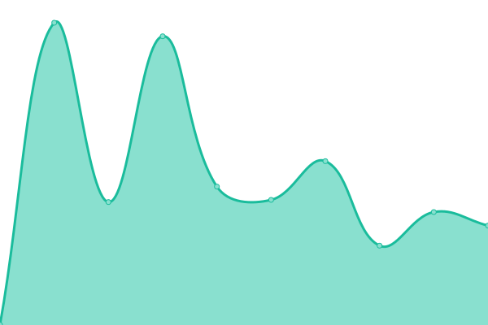
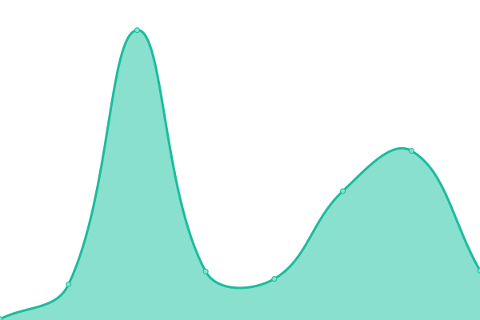
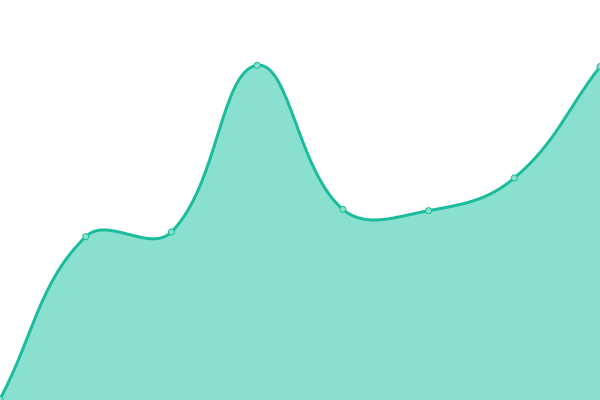
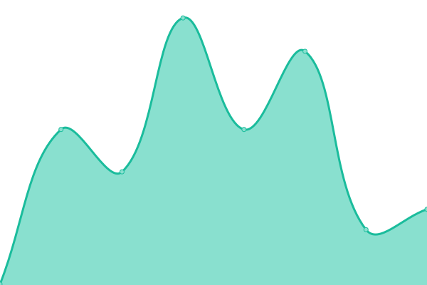
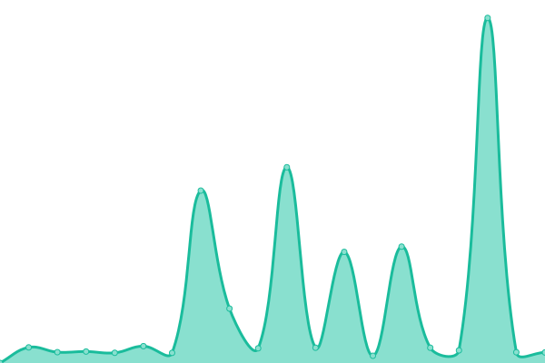

# [📈 Live Status](https://status.zollege.com): <!--live status--> **🟩 All systems operational**

This repository contains the open-source uptime monitor and status page for [Zollege](https://zollege.com), powered by [Upptime](https://github.com/upptime/upptime).

With [Upptime](https://upptime.js.org), you can get your own unlimited and free uptime monitor and status page, powered entirely by a GitHub repository. We use [Issues](https://github.com/Zollege/status/issues) as incident reports, [Actions](https://github.com/Zollege/status/actions) as uptime monitors, and [Pages](https://status.zollege.com) for the status page.

<!--start: status pages-->
<!-- This summary is generated by Upptime (https://github.com/upptime/upptime) -->
<!-- Do not edit this manually, your changes will be overwritten -->
<!-- prettier-ignore -->
| URL | Status | History | Response Time | Uptime |
| --- | ------ | ------- | ------------- | ------ |
|  [Website Start Dates](https://zql.zollege.com/api/5fcaa0e04289f50021ae2b3b?apiKey=f83707c1-2f29-4946-9a47-530e1242fb0e&format=json) | 🟩 Up | [website-start-dates.yml](https://github.com/Zollege/status/commits/HEAD/history/website-start-dates.yml) | 

 804ms
     
 | 

<a href="https://status.zollege.com/history/website-start-dates">100.00%</a>
    

|  [ZQL](https://zql.zollege.com/api/ping/) | 🟩 Up | [zql.yml](https://github.com/Zollege/status/commits/HEAD/history/zql.yml) | 

 133ms
     
 | 

<a href="https://status.zollege.com/history/zql">100.00%</a>
    

|  [Reports (Metabase)](https://reports.zollege.com/api/health) | 🟩 Up | [reports-metabase.yml](https://github.com/Zollege/status/commits/HEAD/history/reports-metabase.yml) | 

 264ms
     
 | 

<a href="https://status.zollege.com/history/reports-metabase">100.00%</a>
    

|  [Lambda](https://4runw89p71.execute-api.us-west-1.amazonaws.com/latest/ping) | 🟩 Up | [lambda.yml](https://github.com/Zollege/status/commits/HEAD/history/lambda.yml) | 

 451ms
     
 | 

<a href="https://status.zollege.com/history/lambda">100.00%</a>
    

|  [Learn (Canvas)](https://learn.zollege.com/health_check/) | 🟩 Up | [learn-canvas.yml](https://github.com/Zollege/status/commits/HEAD/history/learn-canvas.yml) | 

 289ms
     
 | 

<a href="https://status.zollege.com/history/learn-canvas">100.00%</a>
    

<!--end: status pages-->

[**Visit our status website →**](https://status.zollege.com)

## 📄 License

- Powered by: [Upptime](https://github.com/upptime/upptime)
- Code: [MIT](./LICENSE) © [Zollege](https://zollege.com)
- Data in the `./history` directory: [Open Database License](https://opendatacommons.org/licenses/odbl/1-0/)
